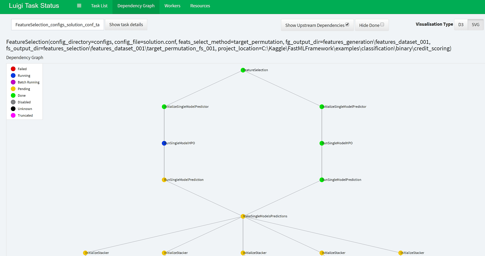
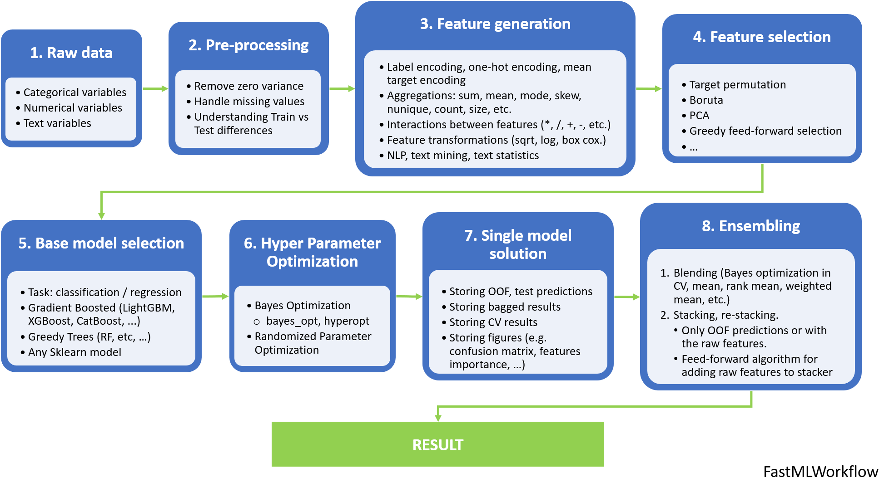

## FastMLFramework

[](https://github.com/minerva-ml/open-solution-home-credit/blob/master/LICENSE)  


-----------------------
**FastML Framework is a python library that allows to build effective Machine Learning solutions using [luigi pipelines](https://luigi.readthedocs.io/en/stable/)**. It provides the following features:

* Well-established structure for the ML experiments allowing to track all the performed tests with the high confidence of not missing anything important. It relies on the use of configuration files where input to any ML task is defined. Process of handling the names of the directories inside the project folder is completely automatized. 
* Automatized features selection in a cross-validation manner. For now, only the target-permutation method is available, but the [Boruta method](https://github.com/scikit-learn-contrib/boruta_py/blob/master) and the [Sequential Forward Feature Selection method](http://rasbt.github.io/mlxtend/user_guide/feature_selection/SequentialFeatureSelector/) will be added shortly.
* Accurate hyper-parameters tuning using Bayes optimization ([bayes_opt library](https://github.com/fmfn/BayesianOptimization)). Hyper-parameters optimization module is re-usable for all-levels models, including stacking models.
* State-of-the art predictive models such as [LightGBM](https://lightgbm.readthedocs.io/en/latest), [XGBoost](https://xgboost.readthedocs.io/en/latest), [Sklearn algorithms](http://scikit-learn.org/stable/supervised_learning.html) for classification and regression.
* Training of the models in robust cross-validation manner. The Framework allows also to reduce the variance error of the predicted results by using implemented bagging procedure. The corresponding out-of-fold (OOF) and test results are automatically persisted. 
* Stacking/blending of the predictions produced by the various single models.
* Rich tool-set for exploratory data analysis (EDA) including visualization of categorical and numerical features, plotting of the binned numerical data, density distributions, automatic detection of the differences between train and test data sets, methods for plotting a comparison between train and test features, etc.

The main goal of this framework is to **collect all re-usable code and the best practices** needed for supervised ML tasks in a single library and to **automatize the entire work-flow by using the pipelines**. User can simply **plug & play various techniques** of the library, such as automatic feature selection, hyper-parameters optimization, bagging, stacking, blending, etc. Last, but not least, the framework allows user to run pipelines on local pc as well as in the cloud (Google Collab, AWS EC2, etc). 

## Install
1. Clone FastMLFramework GitHub repository:
```
git clone https://github.com/sergii1989/FastMLFramework.git
```
2. Go to directory and install requirements:
```
cd FastMLFramework/
pip install -e .
```
## Compatibilities
* It is compatible with: Python 2.7 - 3.6 [64-bit versions only]
* Operating system: Linux, Windows (MacOS not tested)

## Run examples
1. Go to *examples/classification/multiclass/iris directory* or *examples/classification/binary/credit_scoring*
```
cd examples/classification/multiclass/iris directory
or
cd examples/classification/binary/credit_scoring
```
2. Check configuration file *solution.conf* in */configs* sub-directory. There are defined all settings of the task.
3. Open solution notebook in jupyter and run it:
```
jupyter-notebook run_solution.ipynb
```
This will create automatically sub-directories with the results of each ML step, such as **features_selection**, **hyper_parameters_optimization**, **single_model_solution**, **results_ensembling**, etc.

## Usage
The typical work-flow consists of the following steps:
1. Create top-level project directory. 
2. Create sub-directory '**features_generation**'. Inside of this directory one can store various sub-directories containing input train and test files that may be used in building the solution, e.g. '**features_dataset_001**', '**features_dataset_002**'... For now, the library is missing data ingestion class and can handle only .csv files as an input. 
3. Create sub-directory '**configs**' and put there *.conf* file (one can copy it from the examples).
4. Adjust the configuration file to the needs of the problem: 
    * select what input data set to use (in '**features_generation**' directory);
    * select target/index column;
    * select evaluation metrics; 
    * select which ML algorithms to use;
    * select cross-validation settings;
    * specify whether to run feature selection (to reduce dimensionality), hyper-parameters optimization. If yes, which settings to use...
    * specify whether to perform bagging or run solution with one seed only;
    * specify whether to run stacking/blending. If yes, which models to use as stacker; 
    * select whether to stack only OOF data or to include also raw features (if applicable);  
    * select which OOF results to use for stacking/blending (if applicable). 
5. **Run pipeline** (similarly as in the examples above) by providing absolute path to the project directory, name of configuration sub-directory, and name of the configuration file to use;
6. The sub-directories containing results of each step will then be **automatically created** when running the pipeline;
7. When the pipeline is executed on a local machine, one can explore the **dependency graph** of different tasks involved in the pipeline as well as **execution status of the tasks** using the following commands:
    * launch [luigi local scheduler](https://luigi.readthedocs.io/en/stable/central_scheduler.html) by typing in cmd: ```luigid```
    * by default, the server starts on port 8082 (which can be changed with the --port flag): ```http://localhost:8082```
    * set local_scheduler=False when running pipeline:
    ```luigi.build([BuildSolution(project_location, config_directory, config_file)], local_scheduler=False)```
  
      
